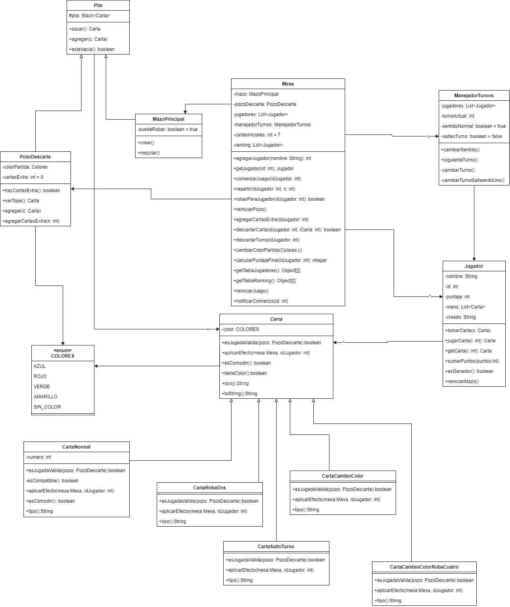

# UNO


[Presentación](https://www.canva.com/design/DAGRshG0JVI/yFrrA2uKWCxPU4zZ4tfUnQ/edit?utm_content=DAGRshG0JVI&utm_campaign=designshare&utm_medium=link2&utm_source=sharebutton)

## Introducción

Este proyecto consiste en la implementacion del juego de cartas "Uno" como parte del trabajo final de la materia Programacion Orientada a Objetos de la Universidad Nacional de Lujan. El objetivo es desarrollar una aplicacion que permita a multiples usuarios conectados simultaneamente en tiempo real, poder jugar una partida de Uno, siguiendo debidamente las reglas del mismo.
En el proyecto se utiliza patrones como MVC y Observer para una mejor organizacion del codigo, ademas de la libreria RMIMVC que provee el equipo docente para la posibilidad de jugar en red.

Se proporcionarán dos tipos de interfaces para jugar: una interfaz gráfica y una interfaz de consola. Ambas interfaces comparten el mismo modelo del juego, asegurando que no se realicen cambios en el modelo para adaptarse a una u otra interfaz.

## Características

- Patron MVC-Observer.
- Juego en red.
- Interfaz grafica y consola sin cambiar el modelo.
- Sistema de puntuaciones
- Ranking persistido para consultar los jugadores con mayor puntaje

## Diagrama de clases



## Requisitos

- JDK (Java Development Kit)
- Git
- Eclipse o cualquier otro IDE (recomendado)
- Un amigo

## Instalación

```bash
git clone https://github.com/lucasrueda01/UnoCardGame.git
```

- Importa el proyecto a tu IDE
- Agrega los archivos .jar al build path.
  - Click derecho al archivo -> build path -> add to build path
- Agregar la carpeta resources como source folder.
  - Click derecho sobre la carpeta -> build path -> use as source folder

## Uso

1. Ejecutar el servidor
    1. Ejecutar la clase AppServidor.java situada en "src/ar/edu/unlu/uno/AppServidor.java"
    2. Selecciona la IP donde se escucharan las peticiones

       

    3. Presione aceptar, luego seleccione el numero de puerto

       

2. Ejecutar el cliente
    1. Ejecutar la clase AppClienteConsola.java o AppClienteGrafica.java, segun la interfaz que prefiera
    2. Seleccionar la IP donde se escucharan las peticiones el cliente.
    

    3. Presione aceptar, luego seleccione el numero de puerto en que escuchará el cliente.
    

    4. Presione aceptar, luego seleccione la IP en la que corre el servidor.
    

    5. Presione aceptar, luego seleccione el numero de puerto que corre el servidor y presione aceptar.
    

3. Repita este ultimo proceso por cada cliente que desee tener en la red.

## Reglas de juego

### Objetivo del Juego

Cada jugador recibe 7 cartas. El objetivo del UNO es ser el primer jugador en quedarse sin cartas.

### Cómo Jugar

En su turno, un jugador puede:

- Jugar una carta que coincida en número, color o símbolo con la carta de la pila de descartes (Izquierda)
- Robar una carta del mazo (Derecha) si no puede jugar una carta. Tras robar, el jugador puede:
  - Jugar una carta de su mano, incluida la que acaba de robar si es jugable.
  - O, si no puede o no quiere jugar, pasar el turno.

## Tipos de Cartas

### Cartas Numéricas

Hay cartas numeradas del 0 al 9 en cuatro colores: rojo, amarillo, verde y azul. Los jugadores deben jugar cartas que coincidan en número, color o tipo con la carta en la cima de la pila de descartes.

### Cartas Comodin

- Carta +2 (Roba Dos): El siguiente jugador debera robar 2 cartas y perder su turno.
- Carta de Cambio de Color: El jugador que la juegue puede elegir el color de la partida que debera seguirse.
- Carta +4 (Roba Cuatro) de Cambio de Color: El jugador que la juegue puede elegir el color de la partida que debera seguirse, y el siguiente jugador debera robar 4 cartas y perder su turno.
- Carta de Salto (Skip): El siguiente jugador perdera su turno.
- Carta de Reversa (Reverse): Invierte el orden de juego.

A tener en cuenta:

- Las cartas +2 y +4 pueden acumularse. Si un jugador recibe un +2 o +4, puede jugar otra carta del mismo tipo (otro +2 o +4). Si un jugador no juega un +2 o +4 tras una acumulación, deberá robar la cantidad total de cartas acumuladas y perderá su turno.

## Final del Juego

El juego continúa hasta que un jugador se quede sin cartas. Ese jugador gana la partida.

### Puntaje

- Las cartas numeradas valen su valor nominal.
- Carta +2: 20 puntos
- Carta Salto: 20 puntos
- Carta Reversa: 20 puntos
- Carta Cambio de Color: 50 puntos
- Carta Cambio de Color +4: 50 puntos

Al final del juego, el ganador obtiene puntos equivalentes a la suma de los valores de las cartas del resto de jugadores. Este puntaje se guardara en un archivo `ranking.dat` que persistira los jugadores con mas puntaje.
