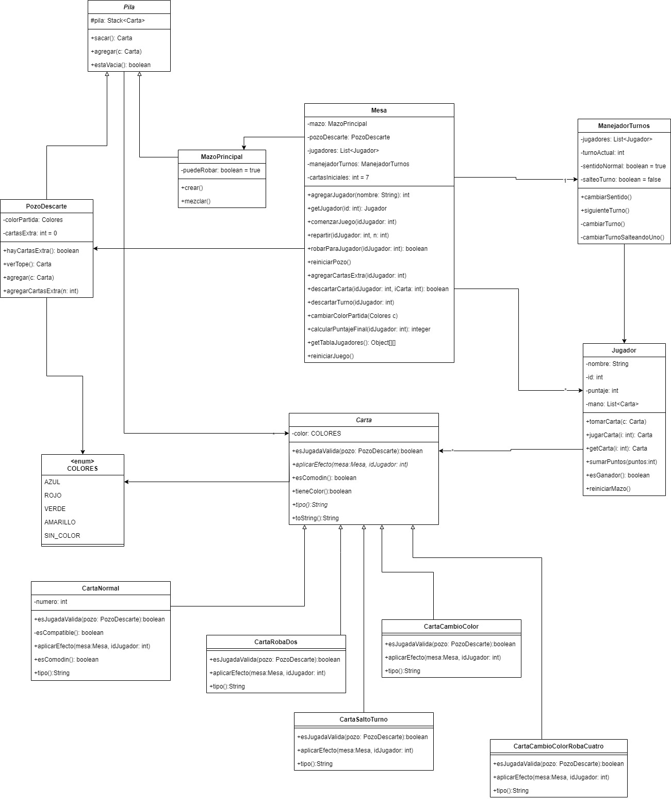

# UNO


## Introduccion

Este proyecto consiste en la implementacion del juego de cartas "Uno" como parte del trabajo final de la materia Programacion Orientada a Objetos de la Universidad Nacional de Lujan. El objetivo es desarrollar una aplicacion que permita a multiples usuarios conectados simultaneamente en tiempo real, poder jugar una partida de Uno, siguiendo debidamente las reglas del mismo.
En el proyecto se utiliza patrones como MVC y Observer para una mejor organizacion del codigo, ademas de la libreria RMIMVC que provee el equipo docente para la posibilidad de jugar en red.

Se proporcionarán dos tipos de interfaces para jugar: una interfaz gráfica y una interfaz de consola. Ambas interfaces comparten el mismo modelo del juego, asegurando que no se realicen cambios en el modelo para adaptarse a una u otra interfaz.

## Características

- Patron MVC-Observer.
- Juego en red.
- Interfaz grafica y consola sin cambiar el modelo.
- Sistema de puntuaciones
- Ranking persistido para consultar los jugadores con mayor puntaje

## Diagrama de clases



## Requisitos

- JDK (Java Development Kit)
- Git
- Eclipse o cualquier otro IDE (recomendado)

## Instalación

```bash
git clone https://github.com/lucasrueda01/UnoCardGame.git
```

- Importa el proyecto a tu IDE
- Agrega los archivos .jar al build path.
    - Click derecho al archivo -> build path -> add to build path
- Agregar la carpeta resources como source folder.
    - Click derecho sobre la carpeta -> build path -> use as source folder

## Uso

1. Ejecutar el servidor
    1. Ejecutar la clase AppServidor.java situada en "src/ar/edu/unlu/mancala/rmi/servidor"
    2. Selecciona la IP donde se escucharan las peticiones

       

    3. Presione aceptar, luego seleccione el numero de puerto

       

2. Ejecutar el cliente
    1. Ejecutar la clase AppClienteConsola.java o AppClienteGrafica.java, segun la interfaz que prefiera
    2. Seleccionar la IP donde se escucharan las peticiones el cliente.
    

    3. Presione aceptar, luego seleccione el numero de puerto en que escuchará el cliente.
    

    4. Presione aceptar, luego seleccione la IP en la que corre el servidor.
    

    5. Presione aceptar, luego seleccione el numero de puerto que corre el servidor y presione aceptar.
    

3. Repita este ultimo proceso por cada cliente que desee tener en la red.
